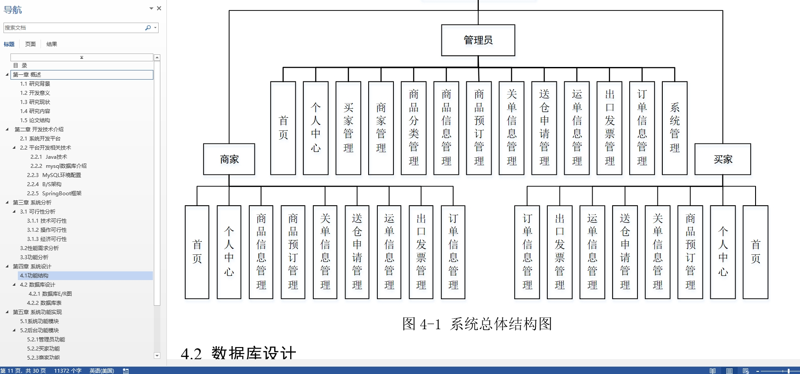

# 1.项目介绍
- 系统角色：管理员、买家、卖家
- 功能模块：商家管理、买家管理、商品分类管理、商品信息管理、预订管理、送仓申请、运单信息、出口发票、订单信息等
- 技术选型：SpringBoot，Vue（后端管理web），LayUI等
- 测试环境：idea2024，jdk1.8，mysql5.7，maven3，node14.16.1
# 2.项目部署
- 创建数据库，导入sql文件
- idea打开项目，根据本地数据库环境修改src/main/resources/application.yml 11-14行
- 启动项目，src/main/java/com/SpringbootSchemaApplication.java
- 打开idea（安装vue.js插件）的终端， cd .\src\main\resources\admin\admin\， 输入 npm install
- 安装成功后，运行项目：npm run serve
- 后端管理web：http://localhost:8080/springboot7l0u0/admin/dist/index.html   管理员账号密码：abo/abo
- 前端门户：http://localhost:8080/springboot7l0u0/front/index.html， 账号密码自行查表
- 说明：vue项目是src/main/resources/admin/admin，若果你不想给idea安装vue插件，你也可以通过vscode或者webstorm去打开vue项目进行安装启动
# 3.项目部分截图

# 4.获取方式
[戳我查看](https://gitee.com/aven999/mall)
